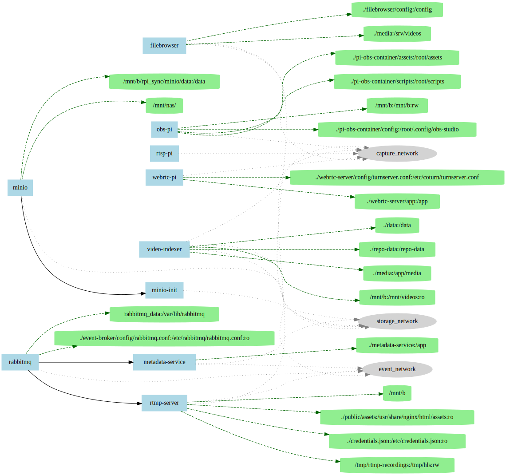

# 🚀 Software-defined Multi-Cam Video Studio Pipeline 

## Local Docker RTMP Server with Nginx and FFmpeg

[](https://github.com/Cdaprod/local-docker-rtmp-server/actions/workflows/ci-build.yml)

[](https://github.com/Cdaprod/local-docker-rtmp-server/actions/workflows/ci-build-and-publish.yml)

---

[](https://github.com/Cdaprod/local-docker-rtmp-server/actions/workflows/generate-nodeprop-configuration.yaml)

---

[](https://github.com/Cdaprod/local-docker-rtmp-server/actions/workflows/generate-repository-diagram.yml)

## Structure of Root Composition



---

#### My Personal TODO List for this Repo@Branch

- merge to main after checks and passing / build
- integrate root /Makefile into /infra/ system and methodology
- continue building of Cdaprod/cdapkg (working copy iphone)
- clean up minio deployment
- clean up tailscale apikey
- reinstitute traefik with tailscale (production networking)

---

## My "Software-defined Multi-Cam Video AI Studio Pipeline"

## Introduction

Welcome to your new broadcast control room -- powered by containers, coffee, and code.  
I’m **Cdaprod**, and this repo is my blueprint for a local-first, software-defined, multi-cam live production pipeline.

## 🎥 DevOps x Hollywood Analogy

Here’s a cinematic + DevOps-style analogy to explain what I’ve built:

> **Streamed Intro Script**
>
> "Well I’m here, and you’re watching this video -- so that means one thing: it worked..."
---

``` 
                 [ iPhone | Nikon | MacBook ]
                          |
                          v
                 ┌─────────────────────┐
                 |     NGINX RTMP      |
                 |  (Live Ingest Apps) |
                 └─────────┬───────────┘
                           v
               ┌───────────────────────────┐
               |      Composite Scene      |
               |    (FFmpeg Scene Mixer)   |
               └─────────┬────────────┬────┘
                         |            |
                   [ RTMP ]        [ HLS ]
                     /                 \
            YouTube, Twitch     Web players, Dash.js
``` 

## ✨ Features

- **Multiple RTMP Applications**: Handle streams from different sources (`iphone`, `nikon`, `macbook`).
- **Composite Scenes**: Combine multiple streams into a single output for professional broadcasting.
- **Portrait Mode Support**: Perfectly scales iPhone portrait streams (9:19.5 aspect ratio).
- **Placeholder Image**: Automatically displays a "We’ll Be Right Back" image when idle.
- **HLS Output**: Multi-quality streams for adaptive playback.
- **Health Checks and Monitoring**: Stay on top of your server's health and stream status.

---

## 🛠 Prerequisites

1. **Docker**: Install Docker on your system.
2. **Docker Compose**: Ensure Docker Compose is available.

---

## 🚧 Setup

1. **Clone the Repository**:
   ```bash
   git clone https://github.com/yourusername/local-docker-rtmp-server.git
   cd local-docker-rtmp-server
   ```

2. **Add Your Placeholder Image**:
   - Place your branded image (`cdaprod-be-right-back.jpeg`) in the `public/assets` directory. Make it snazzy! 🎨✨

3. **Build and Start the Server**:
   ```bash
   docker-compose up --build
   ```

---

## 🔧 Configuration Overview

| **File**       | **Purpose**                                                                            |
|-----------------|----------------------------------------------------------------------------------------|
| `Dockerfile`    | Builds the Docker image with Nginx, RTMP, and FFmpeg.                                  |
| `nginx.conf`    | Configures RTMP applications, transcoding rules, and composite scene generation.       |

---

### RTMP Applications

| **Application** | **Functionality**                                                                 |
|------------------|----------------------------------------------------------------------------------|
| `iphone`         | Handles iPhone portrait streams and streams a placeholder when idle.            |
| `nikon`          | Handles Nikon camera streams.                                                   |
| `macbook`        | Handles MacBook streams.                                                        |
| `scene`          | Combines `iphone`, `nikon`, and `macbook` streams into a single broadcast.       |
| `stream`         | Outputs the final processed stream for public broadcasting.                     |
| `hls`            | Generates HLS output for adaptive playback.                                     |

---

### Ports

| **Port**    | **Description**              |
|-------------|------------------------------|
| `1935`      | RTMP (Publishing/Playback)   |
| `18080`     | HTTP (Health/Stats)          |

---

## 🎬 Usage

### **Publishing Streams**

| **Device**    | **RTMP URL**                                          |
|---------------|-------------------------------------------------------|
| iPhone        | `rtmp://192.168.0.21:1935/iphone/<stream-key>`        |
| Nikon         | `rtmp://192.168.0.21:1935/nikon/<stream-key>`         |
| MacBook       | `rtmp://192.168.0.21:1935/macbook/<stream-key>`       |
| Composite     | `rtmp://192.168.0.21:1935/scene/<stream-key>`         |

### **Playing Streams**

- **RTMP**: `rtmp://192.168.0.21:1935/stream/<stream-key>`
- **HLS**: `http://192.168.0.21:18080/hls/<stream-key>.m3u8`

---

## 🧐 Monitoring

- **Statistics**: `http://192.168.0.21:18080/stat`
- **Health Check**: `http://192.168.0.21:18080/health`

---

## 📝 Notes

- **Device IPs**:
  - iPhone: `192.168.0.10`
  - MacBook: `192.168.0.9`
  - Nikon: `192.168.0.187`
  - RTMP Server: `192.168.0.21`

- **Stream Keys**: Make them unique and secure (e.g., `iphone-live`, `nikon-pro`).

- **Placeholder**: Your custom "We’ll Be Right Back" image streams when idle. 🎨

## RTMP Integration Webhooks

The following endpoints are triggered by the RTMP server (`nginx.conf.template`):
- `/on_publish?app=...&name=...&addr=...&clientid=...`
- `/on_publish_done?app=...&name=...&addr=...&clientid=...`

Both events are enriched and forwarded to RabbitMQ (`stream_events` queue).


---

## 🛠 Troubleshooting

- **Stream Missing**:
  - Check device IPs in `nginx.conf`.
  - Ensure stream key matches.

- **Placeholder Not Displaying**:
  - Verify the image path in `public/assets`.

- **High Resource Usage**:
  - Optimize FFmpeg settings or upgrade hardware.

---

## 🎉 Customization

- **Add More Devices**: 
  - Add applications in `nginx.conf`.
  - Update composite FFmpeg rules.

- **Adjust Quality**:
  - Modify resolutions and bitrates in FFmpeg settings.

- **Update IPs**:
  - Adjust `allow publish` rules in `nginx.conf`.

---

## 🗂 Directory Structure

| **Directory**       | **Contents**                          |
|----------------------|---------------------------------------|
| `app/`               | Contains `nginx.conf` and `Dockerfile`. |
| `public/assets/`     | Holds the placeholder image and assets. |
| `data/recordings/`   | Stores recorded streams.             |
| `tmp/hls/`           | Stores HLS fragments.                |

---

## 🔑 Stream Keys

Stream keys uniquely identify streams. Append them to the RTMP URL like this:

```plaintext
rtmp://192.168.0.21:1935/<application>/<stream-key>
```

| Device        | Application | Stream Key    | Full URL                                            |
|---------------|-------------|---------------|----------------------------------------------------|
| iPhone        | `iphone`    | `iphone-live` | `rtmp://192.168.0.21:1935/iphone/iphone-live`      |
| Nikon         | `nikon`     | `nikon-pro`   | `rtmp://192.168.0.21:1935/nikon/nikon-pro`         |
| MacBook       | `macbook`   | `macbook-test`| `rtmp://192.168.0.21:1935/macbook/macbook-test`    |
| Composite     | `scene`     | `scene-main`  | `rtmp://192.168.0.21:1935/scene/scene-main`        |

---

## ❤️ Contact

- Found an issue? Open an **issue** or make a **PR**. 🚀
- Need help? Find me on **socials**. Let’s chat! ✌️
